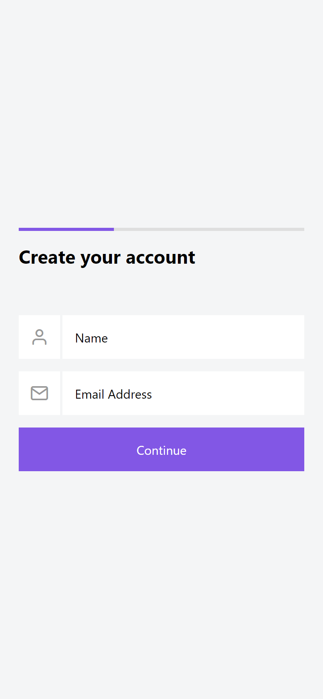
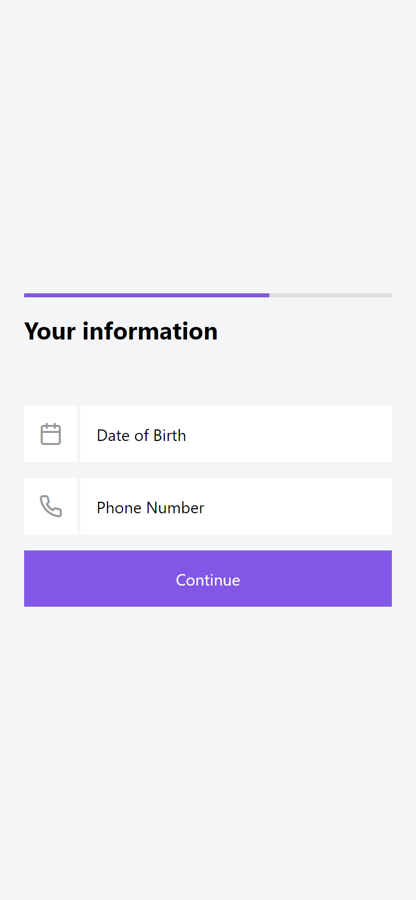
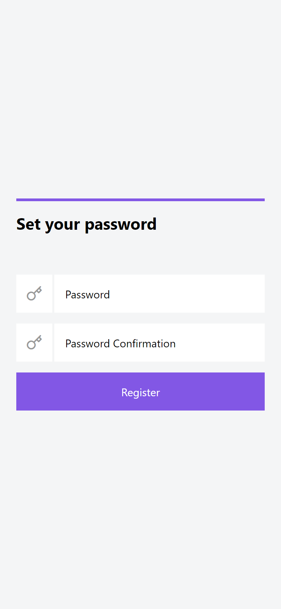

<h1 align="center">
  
Multi-Step Form

  

    
    
    
    
  

</h1>

## ✨ Description

This app was designed to simulate a multi-step registration form using the Context API from React. 
Developed during a React Native Masterclass by [@Rocketseat](https://www.rocketseat.com.br).

## 🚀 Technologies
-  React
    -  States, hooks, props, Context API
-  TypeScript
-  React Native Stack Navigation
-  React Hook Form
-  Expo

## 🌟 Preview

  
  
  

